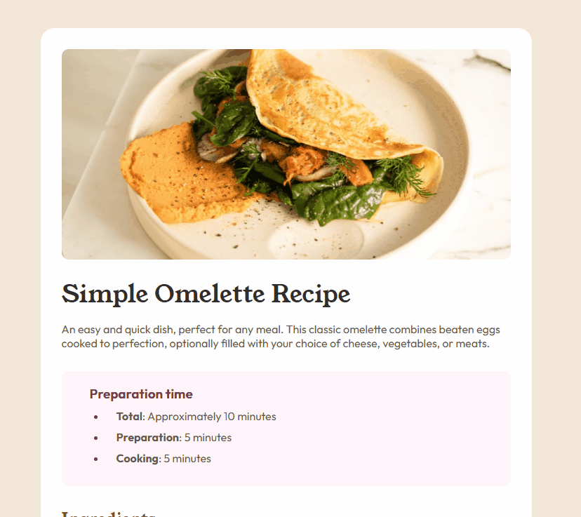

# Frontend Mentor - Solução para página de receita

Esta é a minha solução para o desafio  [Recipe page challenge on Frontend Mentor](https://www.frontendmentor.io/challenges/recipe-page-KiTsR8QQKm) do Frontend Mentor.  
Os desafios do Frontend Mentor ajudam a aprimorar habilidades de codificação através da criação de projetos realistas e focados em boas práticas de desenvolvimento.

## 🗂️ Índice

- [Visão Geral](#visão-geral)
  - [Captura de Tela](#captura-de-tela)
  - [Links](#links)
- [Meu Processo](#meu-processo)
  - [Construído com](#construído-com)
  - [O que Aprendi](#o-que-aprendi)
  - [Desenvolvimento Contínuo](#desenvolvimento-contínuo)
  - [Desafios que Encontrei](#desafios-que-enfrentei)
- [Autor](#autor)
- [Contato](#contato)

---

## Visão Geral 

### Captura de Tela

### Links

- URL do site publicado: [Clique aqui]()

---

## Meu Processo 

### Construído com

- HTML5 semântico
- CSS3 com propriedades personalizadas (CSS Variables)
- Flexbox para layout responsivo
- Fluxo de trabalho Desktop-first
- Controle de versão com Git

### O que Aprendi

- Neste projeto, avancei no aprofundamento das minhas habilidades em HTML e CSS. Apesar de ser uma proposta simples, notei uma evolução no nível de desafio em relação aos projetos anteriores. Consegui utilizar de forma mais eficiente listas e tabelas, aprimorando tanto a estrutura quanto a compreensão do seu comportamento e aplicação em diferentes contextos.

### Desenvolvimento Contínuo

- Estou comprometido em aprimorar continuamente minhas habilidades com HTML, CSS, Git e GitHub, com foco em tornar meu fluxo de trabalho mais ágil, eficiente e colaborativo. Além disso, estou me preparando para integrar JavaScript aos meus projetos, ampliando meu domínio sobre o desenvolvimento web e a criação de soluções mais dinâmicas e interativas.

---
### Desafios que Enfrentei

- O primeiro desafio que enfrentei foi ajustar o espaçamento entre os conteúdos das listas e seus marcadores. Após algumas tentativas, compreendi que esse controle pode ser feito utilizando as propriedades margin-left e padding-left, ajustando seus valores conforme a distância desejada entre o texto, o marcador e a borda.

- Outra dificuldade que tive foi em estilizar a tabela ao fim da receita, no fim consegui utrapassar esse desafio, mas acredito que existam formas mais simples de o fazer.
---

## Autor

- GitHub - [Guilherme-dDiniz](https://github.com/Guilherme-dDiniz)
- Frontend Mentor - [@Guilherme-dDiniz](https://www.frontendmentor.io/profile/Guilherme-dDiniz)
